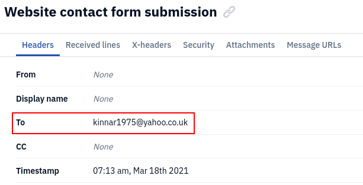
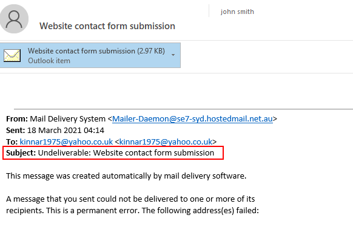
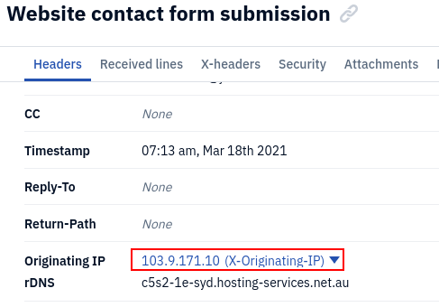
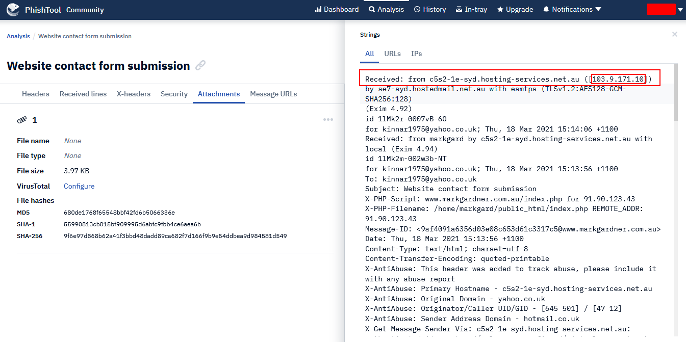
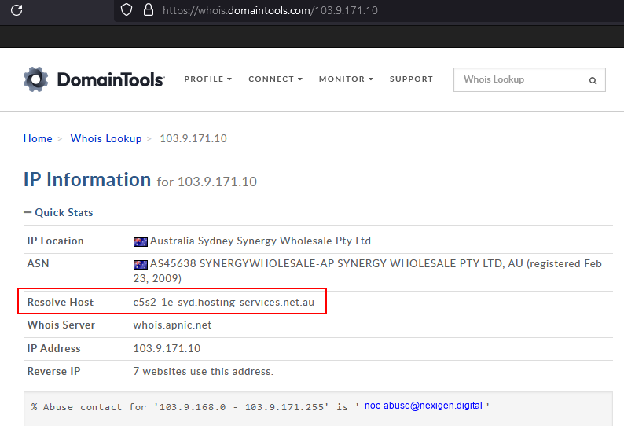
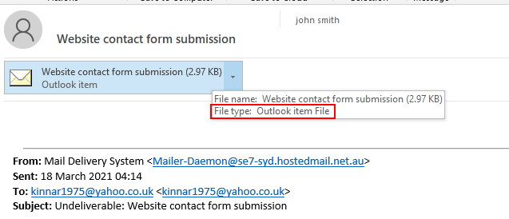
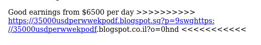
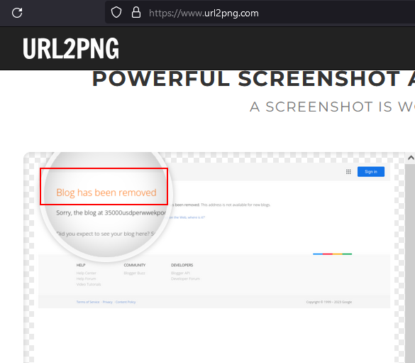
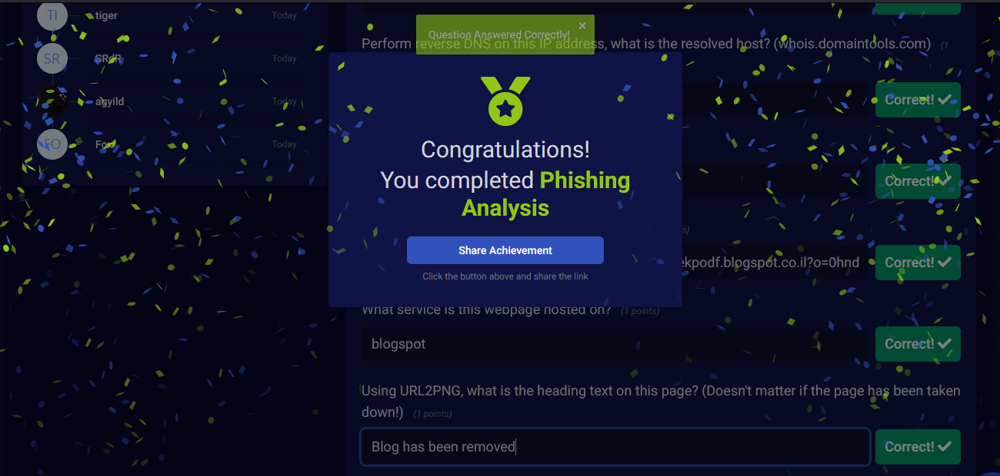

# BTLO - Phishing Analysis

## &#x20;Phishing Analysis

Hello there! I performed some analysis on a phishing email. This is a challenge on Blue Teams Lab Online.\
In this challenge, I used the following tools;

1. Phishtool
2. Outlook
3. URL2PNG

The level of difficulty is easy.

Who is the primary recipient of this email? (1 points)

What is the subject of this email? (1 points)\
What is the date and time the email was sent? (1 points)

What is the Originating IP? (1 points)

Perform reverse DNS on this IP address, what is the resolved host? (whois.domaintools.com) (1 points)

What is the name of the attached file? (2 points)

What is the URL found inside the attachment? (1 points)\
What service is this webpage hosted on? (1 points)\
&#xNAN;_&#x41;ns: blogspot_

_**Using URL2PNG, what is the heading text on this page? (Doesn't matter if the page has been taken down!) (1 points)**_

Hooray!! That's it

## Summary

That was just but one example of how to perform phishing email analysis. Watch out for another example yet
